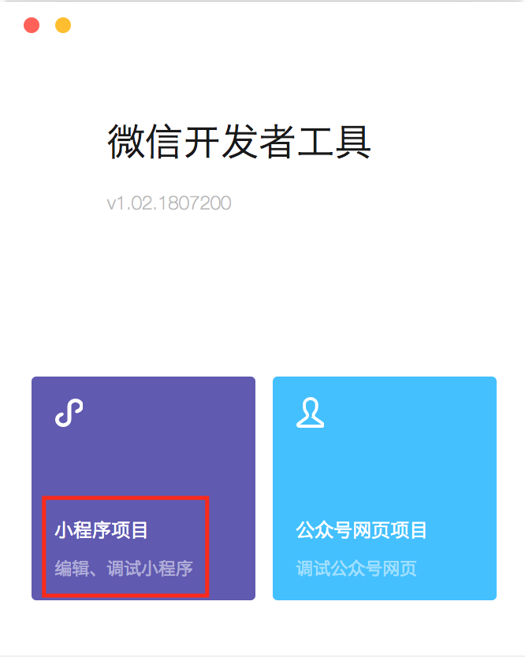
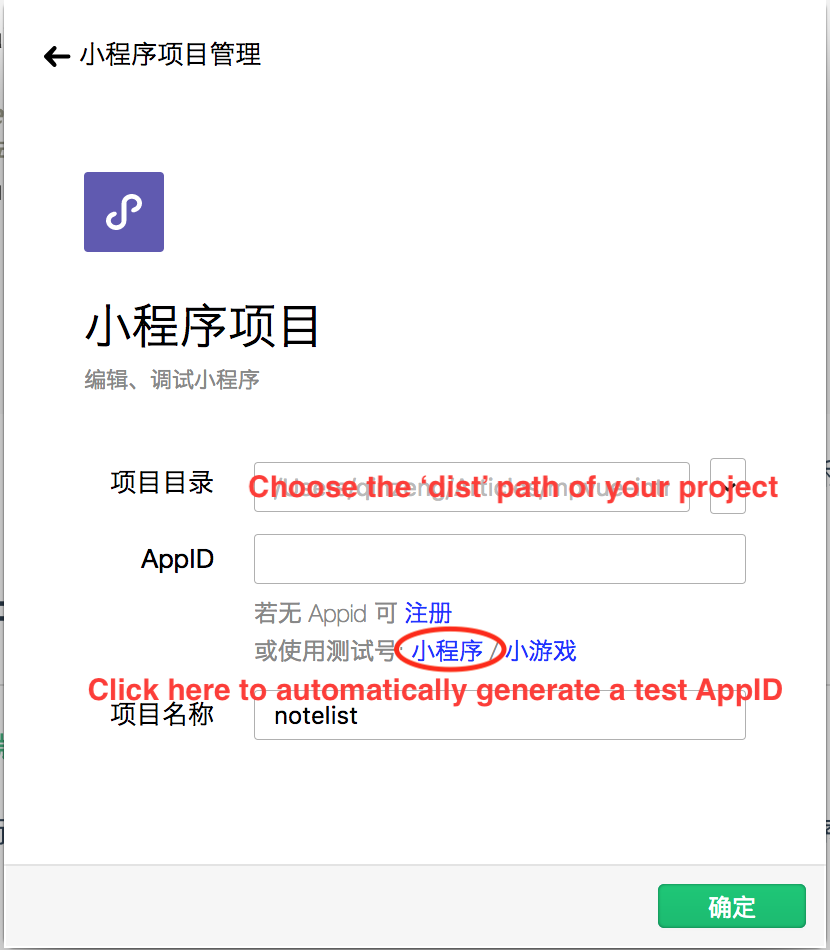
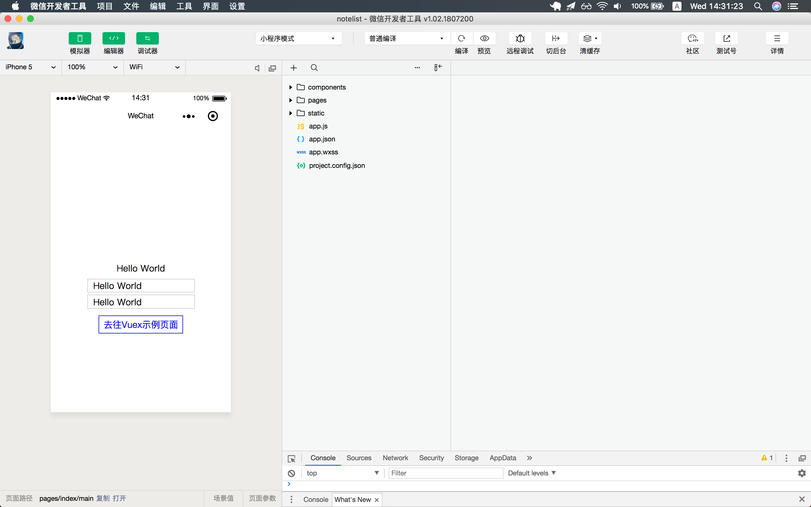
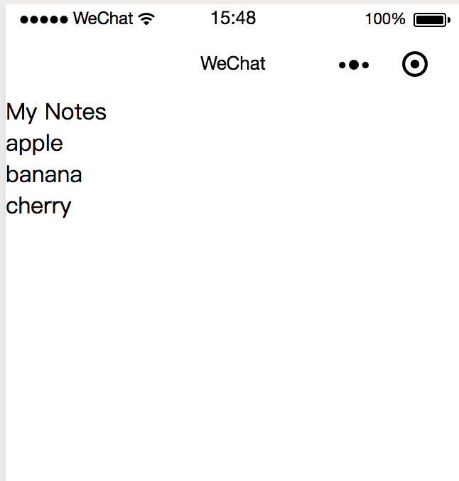
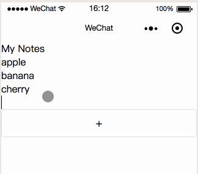
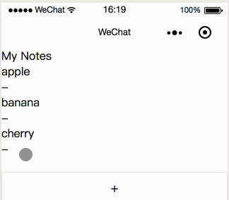

# Making Wechat Mini-Program with Vue.js - A Brief Introduction to mpvue


## What is Wechat Mini-Program


## Problems About the Official Development Kit

The main problem about Mini-Program native development kit is not very friendly to developers. And here is why:

1. The basic codes of Mini-Program are 4 types of files:

- `.json` configuration file, includes path / UI / network timeout / tab etc.
- `.wxml` template file, for page structure, like HTML in web page.
- `.wxss` style file, for page style, like CSS in web page.
- `.js` function file.

The `.wxml` and `.wxss` are similar to `HTML` and `CSS` but still different, you need to learn about them.

2. The codes are split into **Page**s, each **Page** contains its own `.json`, `.wxml`, `.wxss` and `.js` files. This is hard for code re-use.

3. No global state management. Only **Page** gets its own data object. So for a practical Mini-Program the developer needs to maintain a global data object as state and follow every single data changing manually, which is complicated and buggy.

4. Hard to use third libraries. For example, if you want to use `lodash` in Mini-Program, you need to manually copy the entire library into project. And that means when you don't need the library it will make you to remove from codes manually too. Not even mention about the version, updating, codes committment issues.


## Here Comes mpvue to Help

Since almost every frontend developer loves `Vue.js`, why don't use `Vue.js` to develope all Apps on all platforms (and yes this is actually the trending)? Now we get a framework named **mpvue** which could use to develope Wechat Mini-Program in `Vue.js` way.

[mpvue](https://github.com/Meituan-Dianping/mpvue) is based on `Vue.js` and modified the `runtime` and `compiler` to make it could run in Mini-Program environment. So you could develope the Mini-Program just like whatever you do with `Vue.js` in normal web SPAs!


## Simple Demo: A Note List

Now let's take a look at how to make a simple note list app for Wechat Mini-Program, with mpvue of course!

### Init
First of all, initializing the project.

```
$ vue init mpvue/mpvue-quickstart note-list
$ cd note-list
$ npm install
$ npm run dev
```

We created a new project from mpvue quickstart template and then started a build server in local. It will compile all source codes into a directory named **dist** in our new project path.

Download the wechat developer tools from [the official site](https://developers.weixin.qq.com/miniprogram/dev/devtools/download.html).

Install the developer tool, open it up, and choose Mini-Program Development.



In the next screen, let's select our project path and input the AppID. (for more information about AppID, should check the [official docs](https://open.wechat.com/cgi-bin/newreadtemplate?t=overseas_open/index)).



And you will get the **Hello World**.



This is the quickstart demo page from mpvue template. You could goto the vuex demo page to check if vuex works.

### Vuex

Next let's make our notes store. In our project root directory:

```
$ cd src
$ mkdir store
$ touch store/index.js
$ mkdir store/modules
$ touch store/modules/notes.js
```

```
// src/store/index.js

import Vue from 'vue'
import Vuex from 'vuex'

import notes from './modules/notes'

Vue.use(Vuex)

export default new Vuex.Store({
  modules: {
    notes
  }
})
```

This is the store entry file, it includes a module named **notes**.

```
// src/store/modules/notes.js

const types = {
  'NEW_NOTE': 'NEW_NOTE',
  'UPDATE_NOTE': 'UPDATE_NOTE',
  'REMOVE_NOTE': 'REMOVE_NOTE'
}

const state = {
  notes: ['apple', 'banana', 'cherry']
}

const getters = {
  notes: (state) => state.notes
}

const actions = {
  newNote ({ commit }, note) {
    commit(types.NEW_NOTE, note)
  },

  updateNote ({ commit }, index, note) {
    commit(types.UPDATE_NOTE, { index, note })
  },

  removeNote ({ commit }, index) {
    commit(types.REMOVE_NOTE, index)
  }
}

const mutations = {
  [types.NEW_NOTE] (state, note) {
    const newNotes = state.notes.map(n => n)
    newNotes.push(note)
    state.notes = newNotes
  },

  [types.UPDATE_NOTE] (state, { index, note }) {
    const newNotes = state.notes.map(n => n)
    newNotes.splice(index, 1, note)
    state.notes = newNotes
  },

  [types.REMOVE_NOTE] (state, index) {
    const newNotes = state.notes.map(n => n)
    newNotes.splice(index, 1)
    state.notes = newNotes
  }
}

export default {
  state,
  getters,
  actions,
  mutations
}
```

We defined the notes store module, along with the state, actions and mutations. 

Now it's time to show the notes in UI.

```
$ cd src/pages
$ mkdir notes
$ touch notes/index.vue notes/main.js
```

Then let us take a look at `src/main.js`, this is the entry file for whole app. You could change global configuration here. For now the most import configuration to us is the line starts with `pages:`. Change the line like this:

```
pages: ['^pages/notes/main'],
```

This means app homepage will be the notes page we just created.

So what in notes files?

```
// src/pages/notes/main.js

import Vue from 'vue'
import Vuex from 'vuex'
import App from './index'
import store from '../../store'

Vue.use(Vuex)

const app = new Vue({
  store,
  ...App
})
app.$mount()
```

Now we mounted the store in vue component.

```
// src/pages/notes/index.vue

<template>
  <div>
    <h1>My Notes</h1>
    <ul>
      <li v-for="(note, idx) in notes" :key="idx">
        {{ note }}
      </li>
    </ul>
  </div>
</template>

<script>
import { mapGetters } from 'vuex'

export default {
  data() {
    return {
      noteText: ''
    }
  },

  computed: {
    ...mapGetters([
      'notes'
    ])
  }
}
</script>
```

We get the notes from state getters, and display them in a list. Just like this:



### New Note

When we check a note list, sometimes want to put down new note.

And this is new notes file:

```
// src/pages/notes/index.vue

<template>
  <div>
    <h1>My Notes</h1>
    <ul>
      <li v-for="(note, idx) in notes" :key="idx">
        {{ note }}
      </li>
    </ul>
    <input type="text" v-model="noteText">
    <button @click="addNote">+</button>
  </div>
</template>

<script>
import { mapGetters, mapActions } from 'vuex'

export default {
  data() {
    return {
      noteText: ''
    }
  },

  computed: {
    ...mapGetters([
      'notes'
    ])
  },

  methods: {
    addNote() {
      if (this.noteText.trim().length) {
        this.addNewNote(this.noteText.trim())
      }
      this.noteText = ''
    },

    ...mapActions([
      'addNewNote'
    ])
  }
}
</script>
```

There are some new changes:

- an input box and button to submit new note
- new method to handle new note submit

And now it will works like this:



### Remove Note

When we need to remove note. Check the new notes file:

```
// src/pages/notes/index.vue

<template>
  <div>
    <h1>My Notes</h1>
    <ul>
      <li v-for="(note, idx) in notes" :key="idx">
        <span>{{ note }}</span>
        <b @click="deleteNote(idx)">-</b>
      </li>
    </ul>
    <input type="text" v-model="noteText">
    <button @click="addNote">+</button>
  </div>
</template>

<script>
import { mapGetters, mapActions } from 'vuex'

export default {
  data() {
    return {
      noteText: ''
    }
  },

  computed: {
    ...mapGetters([
      'notes'
    ])
  },

  methods: {
    addNote() {
      if (this.noteText.trim().length) {
        this.addNewNote(this.noteText.trim())
      }
      this.noteText = ''
    },

    deleteNote(index) {
      this.removeNote(index)
    },

    ...mapActions([
      'addNewNote',
      'removeNote'
    ])
  }
}
</script>
```

There is a new button for every note now. When click on it, it will call the remove note function with index.

And it works too:


